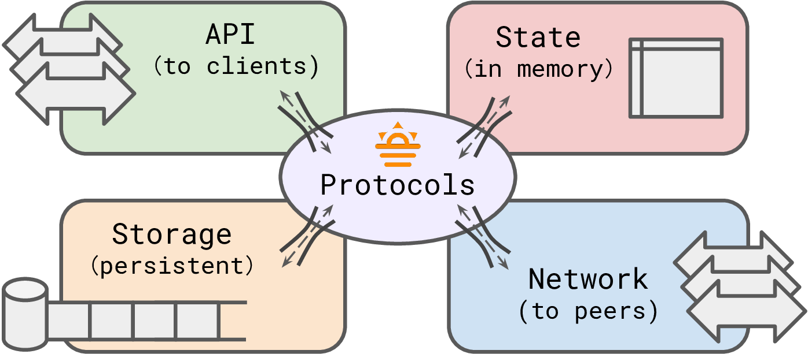

# Summerset 

[](https://github.com/josehu07/summerset/actions?query=josehu07%3Aformat)
[](https://github.com/josehu07/summerset/actions?query=josehu07%3Abuild)
[](https://github.com/josehu07/summerset/actions?query=josehu07%3Atests_unit)
[](https://github.com/josehu07/summerset/actions?query=josehu07%3Atests_proc)
[](https://opensource.org/licenses/MIT)

Summerset is a distributed, replicated, protocol-generic key-value store supporting a wide range of state machine replication (SMR) protocols for research.

<p align="center">
  
</p>

<details>
<summary>List of currently implemented protocols...</summary>

| Protocol | Description | Link |
| :------: | :---------- | :--: |
| `RepNothing` | Simplest protocol with no replication | - |
| `SimplePush` | Pushing to peers w/o consistency guarantees | - |
| `ChainRep` | Bare implementation of Chain Replication | [paper](https://www.cs.cornell.edu/home/rvr/papers/OSDI04.pdf) |
| `MultiPaxos` | Classic MultiPaxos w/ modern features | [paper](https://www.microsoft.com/en-us/research/uploads/prod/2016/12/paxos-simple-Copy.pdf) |
| `EPaxos` | Leaderless-style Egalitarian Paxos | [paper](https://www.cs.cmu.edu/~dga/papers/epaxos-sosp2013.pdf) |
| `Raft` | Raft with explicit log and strong leadership | [paper](https://raft.github.io/raft.pdf) |
| `RSPaxos` | MultiPaxos w/ RS erasure code sharding | [paper](https://madsys.cs.tsinghua.edu.cn/publications/HPDC2014-mu.pdf) |
| `CRaft` | Raft w/ erasure code sharding and fallback | [paper](https://www.usenix.org/system/files/fast20-wang_zizhong.pdf) |
| `Crossword` | Quorum-shards tradeoff for dynamic payloads | tba |
| `QuorumLeases` | Local reads at leaseholders when quiescent | [paper](https://www.cs.cmu.edu/~imoraru/papers/qrl.pdf) |
| `Bodega` | Always-local linearizable reads via roster leases | tba |

Formal TLA+ specification of some protocols are provided in `tla+/`.

More exciting protocols, old and new, are actively being added!

</details>

<details>
<summary>Why is Summerset different from other codebases...</summary>

- **Async Rust**: Summerset is written in Rust and demonstrates an orderly usage of async programming structures backed by the [`tokio`](https://tokio.rs/) framework for distributed replication.
- **Channel/event-based**: Summerset adopts a channel-oriented, event-based system architecture; each replication protocol is basically just a set of event handlers plus a `tokio::select!` loop. The entire codebase contains 0 explicit usage of `Mutex`.
- **Modularized**: Common components of a distributed KV store, e.g. network transport and durable logger, as well as protocol-specific parallelism tasks, are cleanly separated from each other and connected through channels. This extends Go's philosophy of doing "synchronization by (low-cost) communication (of ownership transfers)".
- **Protocol-generic**: With the above points combined, Summerset is able (and strives) to support a set of different replication protocols in one codebase, with common functionalities abstracted out, leaving each protocol's implementation concise and to-the-point.

These design choices make protocol implementation in Summerset rather straight-forward and understandable, without making a sacrifice on performance.

Comments / issues / PRs / usage in your own projects are always welcome!

</details>

## Build

Install the [Rust toolchain](https://rustup.rs/) >= v1.85.0 if haven't. For \*nix:

```bash
curl --proto '=https' --tlsv1.2 -sSf https://sh.rustup.rs | sh
```

Build everything in debug or release (`-r`) mode:

```bash
cargo build [-r] --workspace [--features ...]
```

Run all unit tests:

```bash
cargo test --workspace
```

Generate & open documentation for the core library in browser:

```bash
cargo doc --open
```

## Usage

Summerset currently assumes a Linux environment and is tested on Ubuntu 24.04.

### Launch a Cluster

First, launch the cluster manager oracle (which only serves setup & testing purposes and does not participate in any of the protocol logic):

```bash
cargo run [-r] -p summerset_manager -- -h
```

Then, launch server replica executables:

```bash
cargo run [-r] -p summerset_server -- -h
```

The default logging level is set as >= `info`. To display debugging or even tracing logs, set the `RUST_LOG` environment variable to `debug` or `trace`, e.g.:

```bash
RUST_LOG=debug cargo run ...
```

### Run Client Endpoints

To run a client endpoint executable:

```bash
cargo run [-r] -p summerset_client -- -h
```

Currently supported client utility modes include: `repl` for an interactive CLI, `bench` for performance benchmarking, `tester` for correctness testing, and `mess` for one-shot injection.

### Helper Scripts

Some helper scripts for running Summerset processes are provided. First, install dependencies:

```bash
pip3 install toml
```

You can find the scripts for running Summerset processes locally in `scripts/`:

```bash
python3 scripts/local_cluster.py -h
python3 scripts/local_clients.py -h
```

And for a set of distributed machines (requiring correctly filled `scripts/remote_hosts.toml` file):

```bash
python3 scripts/distr_cluster.py -h
python3 scripts/distr_clients.py -h
```

Note that these scripts use `sudo` and assume specific ranges of available ports, so a Linux server machine environment is recommended.

## Plans

Please check out the [Issues](https://github.com/josehu07/summerset/issues) page for to-do items planned for the codebase.

---

**Lore**: [Summerset Isles](https://en.uesp.net/wiki/Online:Summerset) is the name of an elvish archipelagic province in the Elder Scrolls series. The name also sounds like "a set of SMRs".
